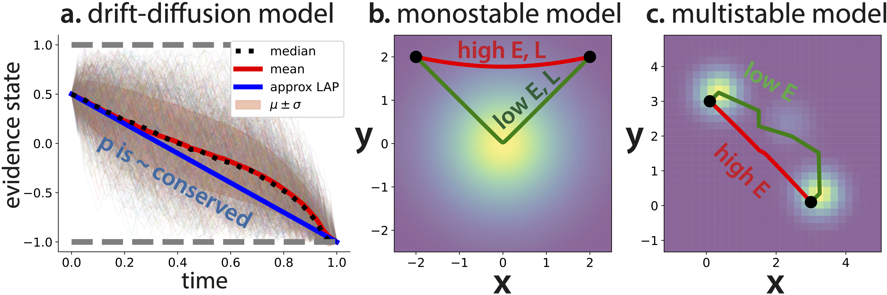

# Code for "Dynamical symmetries in the fluctuation-driven regime: an application of Noether's theorem to noisy dynamical systems" (NeurReps 2024)
 
This repo contains code for a paper from [NeurReps](https://www.neurreps.org) 2024. Only standard libraries (NumPy, SciPy, Matplotlib, and PyTorch) are used.

There is one Jupyter notebook per figure:

**1.** `fig1-decisions.ipynb` Contains code for generating Figure 1, on "Conservation laws relevant to simple decision-making and decision memory models".

**2.** `fig2-diffusion.ipynb` Contains code for generating Figure 2, on "Angular momentum conservation in reverse diffusion".

When the notebooks are run, generated figures appear in the `results/` folder.
