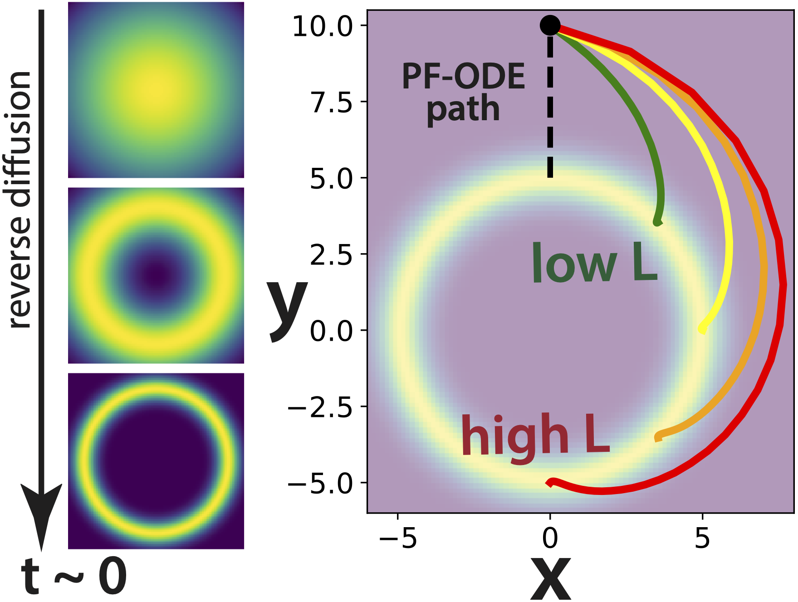

# Dynamical symmetries in the fluctuation-driven regime: an application of Noether's theorem to noisy dynamical systems (NeurReps 2024)

This repo contains code that reproduces the figures from ["Dynamical symmetries in the fluctuation-driven regime: an application of Noether's theorem to noisy dynamical systems"](https://openreview.net/forum?id=lLiIJc7oCJ), a paper accepted to [NeurReps](https://www.neurreps.org) 2024. 

**Abstract:**
> Noether's theorem provides a powerful link between continuous symmetries and conserved quantities for systems governed by some variational principle. Perhaps unfortunately, most dynamical systems of interest in neuroscience and artificial intelligence cannot be described by any such principle. On the other hand, nonequilibrium physics provides a variational principle that describes how fairly generic noisy dynamical systems are most likely to transition between two states; in this work, we exploit this principle to apply Noether's theorem, and hence learn about how the continuous symmetries of dynamical systems constrain their most likely trajectories. We identify analogues of the conservation of energy, momentum, and angular momentum, and briefly discuss examples of each in the context of models of decision-making, recurrent neural networks, and diffusion generative models. 

Only standard libraries (NumPy, SciPy, Matplotlib, and PyTorch) are used. There is one Jupyter notebook per figure:

**1.** `fig1-decisions.ipynb` Contains code for generating Figure 1, on "Conservation laws relevant to simple decision-making and decision memory models".

<p align="center">
</p>

**2.** `fig2-diffusion.ipynb` Contains code for generating Figure 2, on "Angular momentum conservation in reverse diffusion".

<p align="center">
</p>

When the notebooks are run, generated figures appear in the `results/` folder.

## Citation

```
@inproceedings{
    vastola2025dynamical,
    title={Dynamical symmetries in the fluctuation-driven regime: an application of Noether's theorem to noisy dynamical systems},
    author={John Vastola},
    booktitle={NeurIPS 2024 Workshop on Symmetry and Geometry in Neural Representations},
    year={2025},
    url={https://openreview.net/forum?id=lLiIJc7oCJ}
}
```
